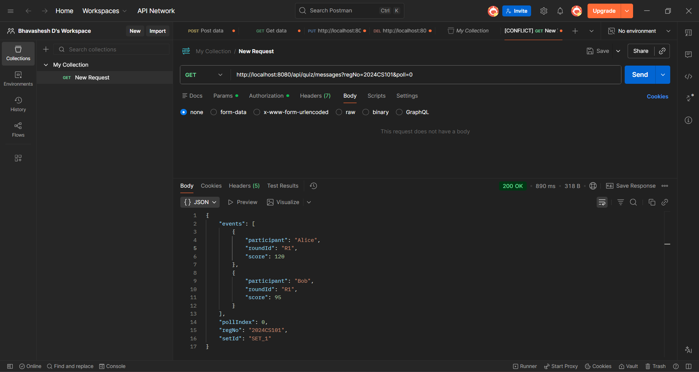
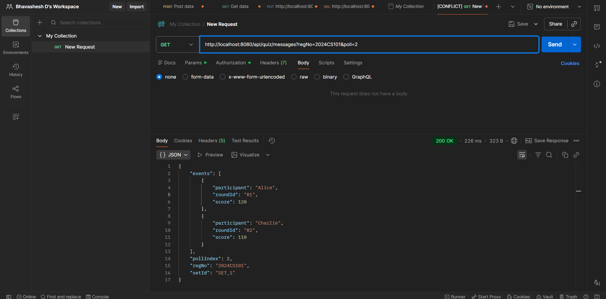
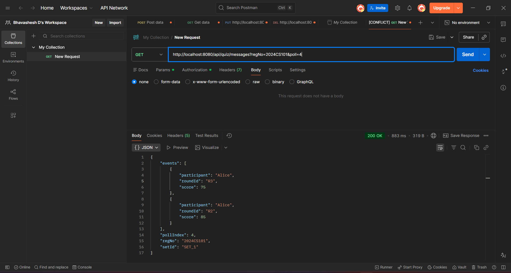
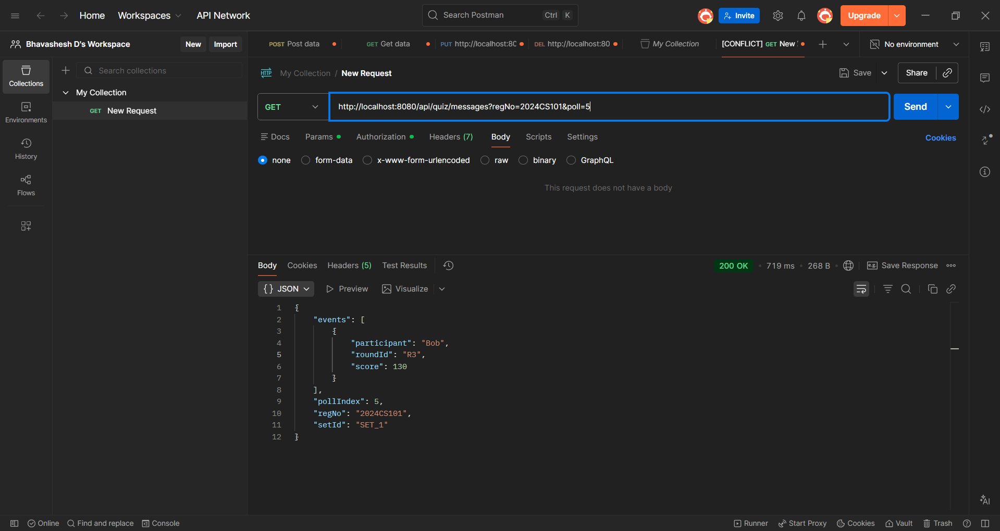
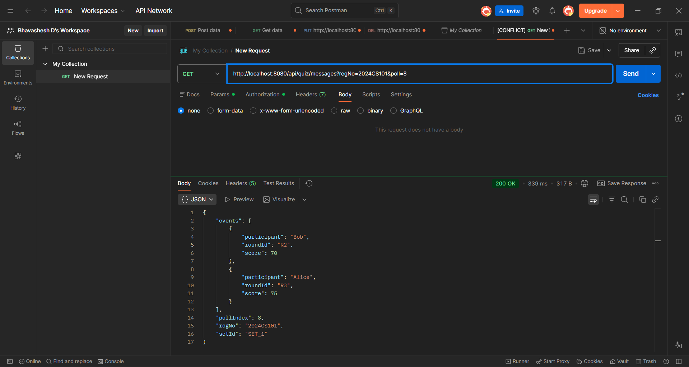
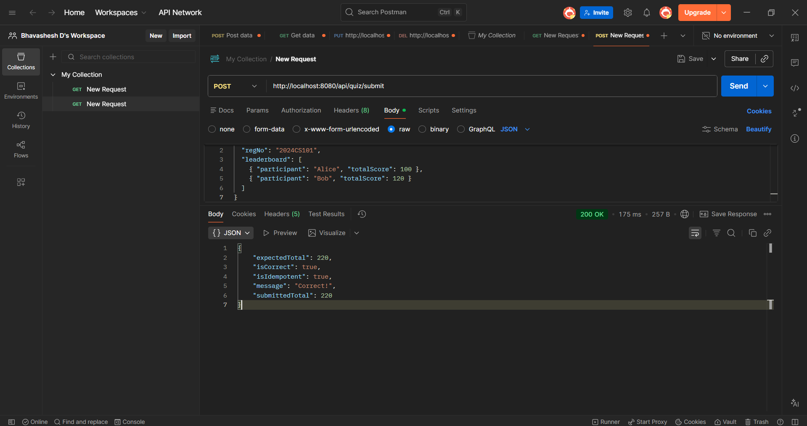

# Quiz Leaderboard System 

This project solves the SRM Quiz backend integration challenge using Spring Boot.

The application polls quiz data across 10 rounds, removes duplicate events, builds a leaderboard, computes total score, and submits the final result to the validator API.

## Problem Summary

In distributed systems, repeated delivery of the same event is common. If duplicates are processed again, total scores become incorrect.

Example:

- Incorrect: Poll 1 -> Alice +10, Poll 3 -> Alice +10 again => Total 20
- Correct: Poll 1 -> Alice +10, Poll 3 -> duplicate ignored => Total 10

This implementation handles exactly that by deduplicating on:

`roundId + participant`

## Tech Stack

- Java 17
- Spring Boot 4
- Gradle
- Lombok

## Project Structure

- `client`: external API calls
- `model`: request/response DTOs
- `service`: business logic (poll, dedup, aggregate, sort, submit)
- `controller`: REST endpoints for Postman testing
- `runner`: optional startup runner

## APIs Used

Base Validator URL:

`https://devapigw.vidalhealthtpa.com/srm-quiz-task`

Validator endpoints:

- `GET /quiz/messages?regNo=<REG_NO>&poll=<0-9>`
- `POST /quiz/submit`

Local testing endpoints exposed by this app:

- `GET /api/quiz/messages?regNo=<REG_NO>&poll=<0-9>`
- `POST /api/quiz/process?regNo=<REG_NO>`
- `POST /api/quiz/submit`
- `GET /health`

## Assignment Flow Implemented

1. Polls API exactly 10 times (poll 0 to poll 9)
2. Keeps mandatory 5-second delay between poll calls
3. Deduplicates events using `roundId|participant`
4. Aggregates score per participant
5. Sorts leaderboard by `totalScore` descending
6. Computes total score of all users
7. Submits final leaderboard once

## Configuration

Set your registration number in the environment:

```powershell
$env:QUIZ_REG_NO="YOUR_REG_NO"
```

Current app properties:

- `quiz.reg-no=${QUIZ_REG_NO:2024CS101}`
- `quiz.runner.enabled=false`
- `quiz.submit.mock-success=false`

## Run Instructions

1. Build/tests:

```powershell
.\gradlew.bat test
```

2. Start server:

```powershell
.\gradlew.bat bootRun --args="--quiz.runner.enabled=false --quiz.submit.mock-success=false"
```

3. Trigger end-to-end flow (recommended):

- Method: `POST`
- URL: `http://localhost:8080/api/quiz/process?regNo=YOUR_REG_NO`

## Test Cases & Expected Outputs

### Test Case 1: GET /api/quiz/messages (Single Poll)

**Purpose:** Fetch events for a specific poll (0-9)

**Request:**
```
GET http://localhost:8080/api/quiz/messages?poll=0
```

**Expected Response (Example):**
```json
{
  "regNo": "2024CS101",
  "setId": "SET_1",
  "pollIndex": 0,
  "events": [
    {
      "roundId": "R1",
      "participant": "Alice",
      "score": 10
    },
    {
      "roundId": "R1",
      "participant": "Bob",
      "score": 20
    }
  ]
}
```

---

### Test Case 2: POST /api/quiz/process (Full Flow: 10 Polls + Dedup + Aggregation + Sort + Submit)

**Purpose:** Execute complete assignment flow (all 10 polls, dedup, aggregate, sort, submit)

**Request:**
```
POST http://localhost:8080/api/quiz/process?regNo=2024CS101
```

**Expected Response (Example):**
```json
{
  "regNo": "2024CS101",
  "leaderboard": [
    {
      "participant": "Bob",
      "totalScore": 120
    },
    {
      "participant": "Alice",
      "totalScore": 100
    },
    {
      "participant": "Charlie",
      "totalScore": 95
    }
  ],
  "totalScore": 315,
  "submissionResponse": {
    "isCorrect": true,
    "isIdempotent": true,
    "submittedTotal": 315,
    "expectedTotal": 315,
    "message": "Correct!"
  }
}
```

---

### Test Case 3: POST /api/quiz/submit (Manual Submission)

**Purpose:** Submit leaderboard directly (for testing submit endpoint separately)

**Request:**
```
POST http://localhost:8080/api/quiz/submit
Content-Type: application/json

{
  "regNo": "2024CS101",
  "leaderboard": [
    {
      "participant": "Bob",
      "totalScore": 120
    },
    {
      "participant": "Alice",
      "totalScore": 100
    }
  ]
}
```

**Expected Response:**
```json
{
  "isCorrect": true,
  "isIdempotent": true,
  "submittedTotal": 220,
  "expectedTotal": 220,
  "message": "Correct!"
}
```

---

## Deduplication Example (Detailed)

### Before Deduplication (Raw Data from 10 Polls)

Poll 0 returns:
```
Alice R1: +10
Bob R1: +20
```

Poll 3 returns (duplicate):
```
Alice R1: +10  ← DUPLICATE
Bob R1: +20    ← DUPLICATE
```

Poll 5 returns:
```
Charlie R2: +15
Alice R2: +5
```

**Raw Total (without dedup):** Alice 25, Bob 40, Charlie 15 → **Total: 80** ❌

### After Deduplication (Using roundId|participant as Key)

Dedup keys tracked:
- `R1|Alice` ✓ (added in Poll 0)
- `R1|Bob` ✓ (added in Poll 0)
- `R1|Alice` ✗ (Poll 3: duplicate, ignored)
- `R1|Bob` ✗ (Poll 3: duplicate, ignored)
- `R2|Charlie` ✓ (added in Poll 5)
- `R2|Alice` ✓ (added in Poll 5)

**Final Aggregated Scores:**
- Alice: 10 (R1) + 5 (R2) = **15**
- Bob: 20 (R1) = **20**
- Charlie: 15 (R2) = **15**

**Correct Total:** 15 + 20 + 15 = **50** ✅

---

## Postman Evidence

### Poll Calls (0 to 9)

#### Poll 0



#### Poll 1


#### Poll 2



#### Poll 3


#### Poll 4



#### Poll 5



#### Poll 6


#### Poll 7


#### Poll 8



#### Poll 9


### Final Post Call



## Notes About Real Validator Responses

- The sample response in assignment docs is an example format.
- Live validator values (scores, setId behavior, message text) can differ by runtime and dataset.
- Correctness is determined by validator-side expected leaderboard for your regNo.

## Dedup Logic (Core Proof)

The logic uses a set of unique keys:

- Key format: `roundId|participant`
- If key already exists, event is ignored
- If key is new, score is added

This ensures duplicate events across different polls are processed only once.

